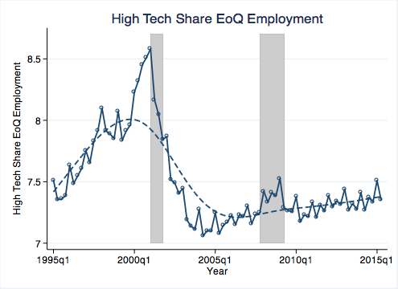
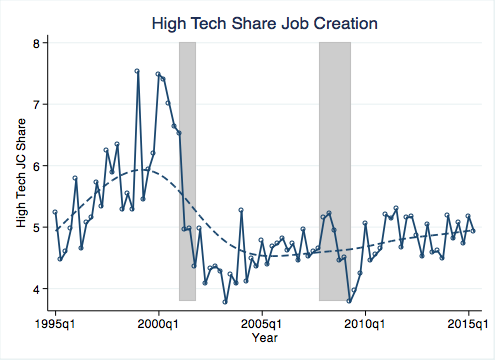
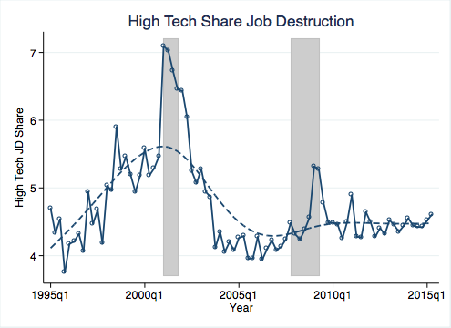
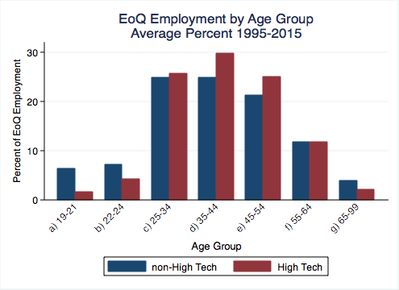
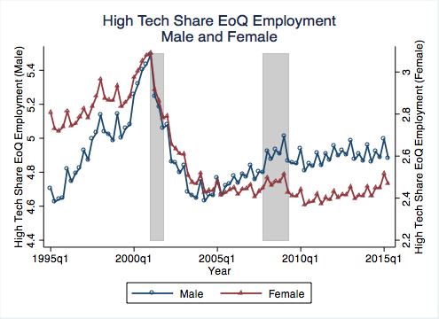
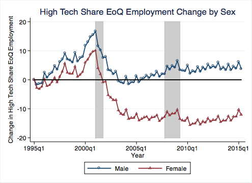
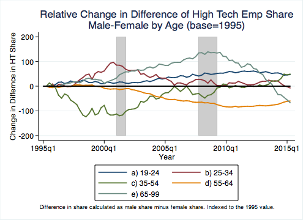

#Demographics of High Tech Employment

*Nathan Goldschlag* and *Lars Vilhuber*

*November 2016*

We use the [Quarterly Workforce Indicators](http://lehd.ces.census.gov/data/#qwi) to analyze age and gender differences in employment in high-tech industries. 

## Data Construction

We are all over the place in terms of our toolkit. Python, SAS, and Stata are used, but we might add a few later.

### Mapping High-Tech Occupations to Industries

The ipython notebook in the [python](python/) directory use industry-occupation employment data to calculate identify High Tech industries in 2012 and 2014 following the approach in Hecker (2005). This method uses the relative concentration of STEM employment by industry. This implementation relies on the set of 2000 SOC occupations (concorded to 2010 SOC) identified in Hecker (2005) as "technology oriented". Similar results can be obtained using the BLS 2010 listing of STEM occupations. (Goldschlag and Miranda). The resulting data is stored in the [data](data/) directory.

### Quarterly Workforce Indicators
The programs in the [SAS](sas/) directory download  [Quarterly Workforce Indicators](http://lehd.ces.census.gov/data/#qwi) to analyze how employment dynamics differ by demographic characteristics across high-tech industries. A collapsed set of data files is available in gzipped format in the [data](data/) folder.

##Analysis
The very preliminary analysis is performed by combining the high-tech indicators with the QWI, and graphing some basic observations (see [qwi_ht_analysis](plots/qwi_ht_analysis.do) Stata program).

## Intriguing Results
### The Dot-com Bust
QWI shows a 1 point decline in the overall HT  employment share from the peak in 2001 to 2005. This seems a bit higher (from a higher base) than the equivalent BDS graph (not shown here):

### Overall churn is lower
The gap between HT and non HT is about 2 points. The gap is about 3-4 points with non-HT consistently higher for both JCR and JDR. 

The 2001 spike in JD is much more pronounced in the share measure. This agrees with the spike in JD we observe in the BDS in 2001 (not shown here):

### Basic Facts about the Age of HT Workers
On average, HT workers tend to be concentrated in the 25-64 age range. Workers in the 35-44 age bracket made up about 30% of HT employment compared to non-HT where these workers accounted for about 23% of employment. Workers in HT industries are under represented in young age groups including 22-24, which accounted for about 4% of employment in HT and almost 7% in non-HT.

In terms of time series patterns, the share of HT employment in the 55-99 group has increased dramatically over the time period. When you peal that apart, all three of the oldest age groups are increasing, each more dramatically than the last. The oldest group, 65-99, more than doubled since 1995. Interestingly, there is sort of an influx of young workers pre 2001 that subsequently drops off and stays negative.

Another interesting pattern we see in the age data is that the decline in JC and rise in JC in 2001 is most dramatic for younger workers, 25-34. 

### Basic Facts about the Sex of HT Workers
About 4% of male workers in QWI are in H, and about 2% of females. Female HT share declined more significantly than did male HT share post 2001. (Note: female scale on right)

Indexing to 1995:

Job creation and destruction:

### Changes in female underrepresentation
The other intriguing fact is that female underrepresentation is a feature of the older age groups, and may be a cohort effect - in fact, among younger age groups, the female share of the high-tech workforce is greater than the male share (note: female high-tech employment as a share of overall female employment is larger than male high-tech employment as a share of overall male employment). In all age groups, these seem to be converging.

With index 1995=0

## Disclaimer
This site is maintained by Nathan Goldschlag and Lars Vilhuber. Opinions expressed here do not reflect the official views of the U.S. Census Bureau or any other public or private organization.

##References
Hecker, Daniel E. (2005). [High-technology employment: a NAICS-based update](http://www.bls.gov/opub/mlr/2005/07/art6full.pdf). Monthly Lab. Rev., 128, 57.

