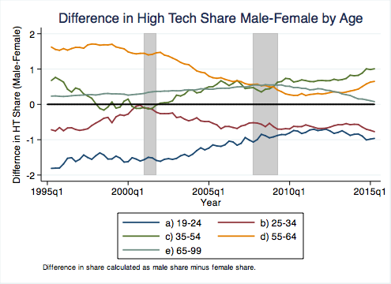

#Demographics of High Tech Employment

*Nathan Goldschlag* and *Lars Vilhuber*

*September 2016*

We use the [Quarterly Workforce Indicators](http://lehd.ces.census.gov/data/#qwi) to analyze age and gender differences in employment in high-tech industries. 

## Data Construction

We are all over the place in terms of our toolkit. Python, SAS, and Stata are used, but we might add a few later.

### Mapping High-Tech Occupations to Industries

The ipython notebook in the [python](python/) directory use industry-occupation employment data to calculate identify High Tech industries in 2012 and 2014 following the approach in Hecker (2005). This method uses the relative concentration of STEM employment by industry. This implementation relies on the set of 2000 SOC occupations (concorded to 2010 SOC) identified in Hecker (2005) as "technology oriented". Similar results can be obtained using the BLS 2010 listing of STEM occupations. (Goldschlag and Miranda). The resulting data is stored in the [data](data/) directory.

### Quarterly Workforce Indicators
The programs in the [SAS](sas/) directory download  [Quarterly Workforce Indicators](http://lehd.ces.census.gov/data/#qwi) to analyze how employment dynamics differ by demographic characteristics across high-tech industries. A collapsed set of data files is available in gzipped format in the [data](data/) folder.

##Analysis
The very preliminary analysis is performed by combining the high-tech indicators with the QWI, and graphing some basic observations (see [qwi_ht_analysis](plots/qwi_ht_analysis.do) Stata program).

## Intriguing Results

There seems to be a subtle aging of the high-tech workforce. While overall employment shares are higher for younger workers, the only demographic group that is increasing employment share are workers over 55:

This holds in particular for the (few) workers over 65, but is also present in younger cohorts:

The other intriguing fact is that female underrepresentation is a feature of the older age groups, and may be a cohort effect - in fact, among younger age groups, the female share of the high-tech workforce is greater than the male share (note: female high-tech employment as a share of overall female employment is larger than male high-tech employment as a share of overall male employment). In all age groups, these seem to be converging.

## Disclaimer
This site is maintained by Nathan Goldschlag and Lars Vilhuber. Opinions expressed here do not reflect the official views of the U.S. Census Bureau or any other public or private organization.

##References
Hecker, Daniel E. (2005). [High-technology employment: a NAICS-based update](http://www.bls.gov/opub/mlr/2005/07/art6full.pdf). Monthly Lab. Rev., 128, 57.

