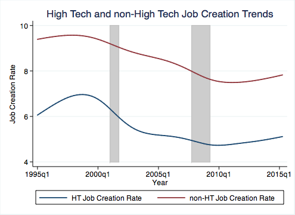
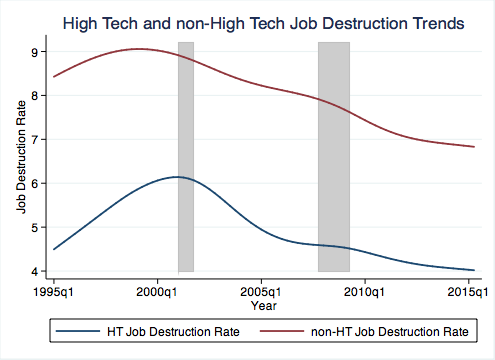
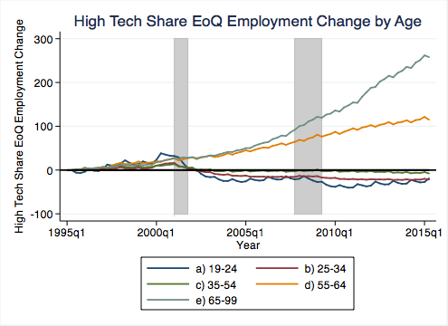
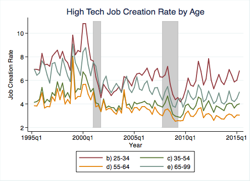
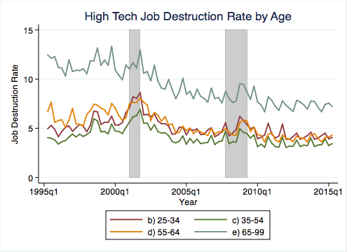
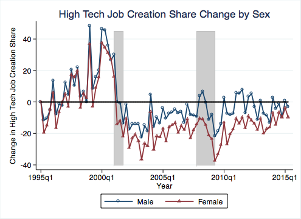
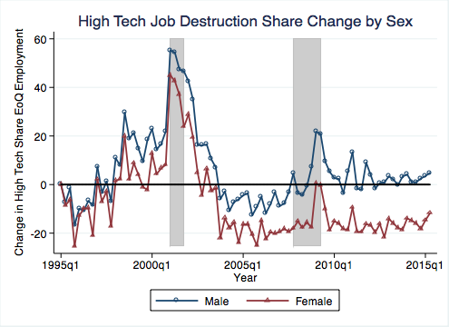

Demographics of High Tech Employment
========================================================
author: *Nathan Goldschlag* and *Lars Vilhuber*
date: November 2016
autosize: true

We use the [Quarterly Workforce Indicators](http://lehd.ces.census.gov/data/#qwi) to analyze age and gender differences in employment in high-tech industries. 

Data Construction
================= 
We are all over the place in terms of our toolkit. Python, SAS, and Stata are used, but we might add a few later.

Data
=================
# Mapping High-Tech Occupations to Industries
* industry-occupation employment data identify High Tech industries in 2012 and 2014 following the approach in Hecker (2005). 
* This method uses the relative concentration of STEM employment by industry. 
* This implementation relies on the set of 2000 SOC occupations (concorded to 2010 SOC) identified in Hecker (2005) as "technology oriented". 
* Similar results can be obtained using the BLS 2010 listing of STEM occupations. (Goldschlag and Miranda). 

The resulting data is stored in the [data](../data/) directory.

High-tech occupations (SOC 2000)
=====================
* computer and mathematical scientists, SOC 15-0000; 
* engineers, SOC 17–2000; 
* drafters, engineering, and mapping technicians, SOC 17–3000; 
* life scientists, SOC 19–1000; 
* physical scientists, SOC 19–2000; 
* life, physical, and social science technicians, SOC 19–4000;
* computer and information systems managers, SOC 11–3020;
* engineering managers, SOC 11–9040; 
* natural sciences managers, SOC 11–9120. 

*** 
Workers in these occupations need an
in-depth knowledge of the theories and principles of science,
engineering, and mathematics underlying technology, a knowledge
generally acquired through specialized post-high school
education in some field of technology leading up to an award
ranging from a vocational certificate or an associate’s degree to
a doctorate. Individuals employed in these occupations are
collectively referred to as technology-oriented workers ([Hecker, 2005](http://www.bls.gov/opub/mlr/2005/07/art6full.pdf#page=2))

Mapping to industries
=================
(this from https://github.com/ngoldschlag/HighTechIndustries)

BLS Industry-Occupation data for several years is used to map occupations into industries. SOC 2000 is crosswalked into SOC 2010. BLS OES data can be found at http://www.bls.gov/oes/tables.htm.

* Level I industries have STEM ratio greater than (or equal to) 5 times the average STEM concentration
* Level II includes industries with a STEM employment ratio between 3 and 5 times the average
* Level III includes industries with a STEM employment ratio between 2 and 3 times the average.

## Output data
* The result of this exercise is in the [data](../data/) folder.
* Hecker (2005) finds overall about **4.9%** of workers in "technology-oriented occupations."

Data
=================

# Quarterly Workforce Indicators

## The programs 
in the [SAS](sas/) directory download  [Quarterly Workforce Indicators](http://lehd.ces.census.gov/data/#qwi) to analyze how employment dynamics differ by demographic characteristics across high-tech industries. 

## Output data
A collapsed set of data files is available in gzipped format in the [data](../data/) folder.

Analysis
=================
The very preliminary analysis is performed by combining the high-tech indicators with the QWI, and graphing some basic observations (see [qwi_ht_analysis](../plots/qwi_ht_analysis.do) Stata program).

Intriguing Results
================= 

QWI data have a higher fraction of employment in high-tech industries 
**(7.91%**) 
in 2000 than Hecker (2005), which is to be expected, since Hecker (2005) counts employment only in HT occupations, whereas the BDS and QWI measures capture additional non-HT employment in those same industries.

# The Dot-com Bust
QWI shows a 1 point decline in the overall HT  employment share from the peak in 2001 to 2005. This seems a bit higher (from a higher base) than the equivalent BDS graph (not shown here):

Intriguing Results
=================
# Overall churn is lower

The gap is about 3-4 points with non-HT consistently higher for both JCR and JDR. 

Overall churn is lower
=================

***

Intriguing Results
=============
The 2001 spike in JD is much more pronounced in the share measure. This agrees with the spike in JD we observe in the BDS in 2001 (not shown here):

2001 spike in JD
===============

***

Intriguing Results
=================
# Basic Facts about the Age of HT Workers

* On average, HT workers tend to be concentrated in the 25-64 age range. 
* Workers in the 35-44 age bracket made up about 30% of HT employment compared to non-HT (23% of employment).
* Workers in HT industries are under represented in young age groups including 22-24, which accounted for about 4% of employment in HT and almost 7% in non-HT.

Basic Facts about the Age of HT Workers
==========

Intriguing Results
===================
# Share of HT workers by age
In terms of time series patterns, the share of HT employment in the 55-99 group has increased dramatically over the time period. When you peal that apart, all three of the oldest age groups are increasing, each more dramatically than the last. The oldest group, 65-99, more than doubled since 1995. Interestingly, there is sort of an influx of young workers pre 2001 that subsequently drops off and stays negative.

Share of HT workers by age
=================

***

Intriguing Results
=================
# Differences in Job Creation by age
Another interesting pattern we see in the age data is that the decline in JC and rise in JC in 2001 is most dramatic for younger workers, 25-34. 

Differences in Job Creation by age
=================

***

============= 
# Basic Facts about the Sex of HT Workers
About 4% of male workers in QWI are in H, and about 2% of females. Female HT share declined more significantly than did male HT share post 2001. (Note: female scale on right)

Basic Facts about the Sex of HT Workers
============= 

***

Job creation and destruction by sex
============= 

Basic Facts about the Sex of HT Workers
============= 
# Changes in female underrepresentation
The other intriguing fact is that female underrepresentation is a feature of the older age groups, and may be a cohort effect - in fact, among younger age groups, the female share of the high-tech workforce is greater than the male share (note: female high-tech employment as a share of overall female employment is larger than male high-tech employment as a share of overall male employment). In all age groups, these seem to be converging.

Changes in female underrepresentation
=====================

***

Disclaimer
================= 
This site is maintained by Nathan Goldschlag and Lars Vilhuber. Opinions expressed here do not reflect the official views of the U.S. Census Bureau or any other public or private organization.

References
=================
Hecker, Daniel E. (2005). [High-technology employment: a NAICS-based update](http://www.bls.gov/opub/mlr/2005/07/art6full.pdf). Monthly Lab. Rev., 128, 57.

